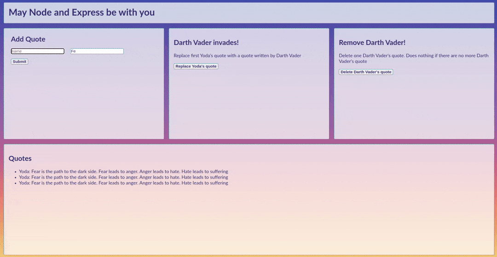

# Star Wars themed CRUD app demo

A simple Star Wars-themed CRUD app based on Node.js and MongoDB. based on
[zellwk tutorial](https://zellwk.com/blog/crud-express-mongodb/)

## How It's Made:

**Tech used:** Node.js | MongoDB | Express | Nodemon | Body-parser | EJS |
dotenv

Based on npm packages, we built a Star Wars-themed CRUD system.

- Express served to simplify handling HTTP requests and responses.
- Body-parser handled our form data and returned them as a body property on our
  request object
- MongoDB npm package was utilized to interface with our remote mongoDB atlas
  database
- EJS as a template engine. we utilized EJS to easily generate HTML content
  responses from our database
- Nodemon automatically refreshed our project while in development to save time
  and the effort of refreshing Node
- Dotenv added to manage database credentials
